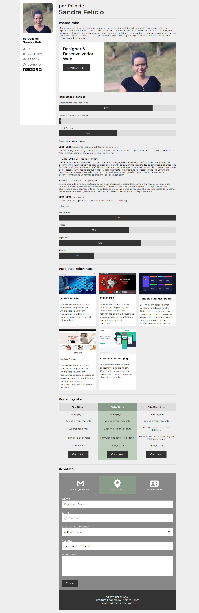

## Instituto Federal do Espírito Santo

# Atividade Prática da Semana 5
# https://mjpfelicia.github.io/atividade-pratica-semana-5/

                 Welcome! 👋

## Índice

.Desafio
.Links
.Tecnologias usadas
.O que eu aprendi
.Recursos úteis
.Desafio
.layout ideal para a seção, dependendo do tamanho da tela

## Links usados:

https://developer.mozilla.org/en-US/docs/Learn/CSS
https://www.youtube.com/watch?v=mThw9Z9kgHg&t=62s

## Tecnologias usadas:
Marcação HTML5 semântica
CSS

## O que eu aprendi

Melhorando as habilidades no CSS
Marcadores semânticos importantes - - para HTML
Praticando para melhorar o - - design da página

## Autor
@mjpfelicia
